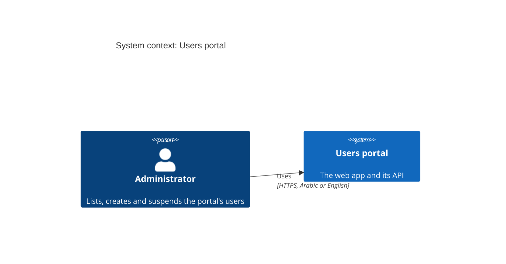

# System context: Users portal

Who uses the portal and what it depends on (C4 level 1). Decisions: D-001 (administrators only),
D-012 (no external services in this release).

```mermaid
C4Context
  title System context: Users portal
  Person(admin, "Administrator", "Lists, creates and suspends the portal's users")
  System(portal, "Users portal", "The web app and its API")
  Rel(admin, portal, "Uses", "HTTPS, Arabic or English")
```
